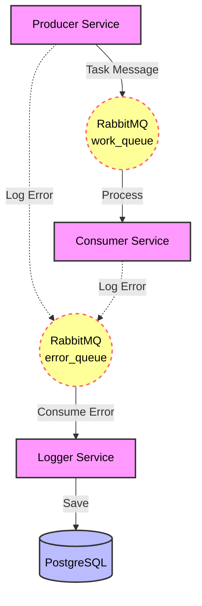

# 🛡️ Microservices Centralized Logging


Проект демонстрирует реализацию паттерна **Centralized Logging** в микросервисной архитектуре.
Сервисы работают независимо и отправляют информацию об ошибках в единую шину данных (RabbitMQ), откуда специальный сервис-логгер сохраняет их в реляционную базу данных (PostgreSQL).

---

## 🏗 Архитектура

Система состоит из 4-х компонентов, оркестрируемых через Docker Compose.



### Компоненты:
1.  **Producer Service:** Генерирует задачи. Периодически имитирует сбои (каждое 5-е сообщение) и отправляет отчет об ошибке.
2.  **Consumer Service:** Обрабатывает задачи. Имитирует бизнес-ошибки (валидация данных) и отправляет отчет.
3.  **Logger Service:** Специализированный сервис. Слушает очередь ошибок, десериализует JSON и сохраняет записи в PostgreSQL через EF Core.
4.  **Common Library:** Общая библиотека (`Shared Kernel`), содержащая контракты данных (`LogEntry`) и логику отправки в RabbitMQ (`ErrorSender`), обеспечивая принцип DRY.

---

## 🚀 Основные возможности

*   **Resilience (Устойчивость):** Все сервисы реализуют политику **Retry Pattern**. При старте они ожидают доступности RabbitMQ и Базы Данных, не завершая работу аварийно.
*   **Asynchronous Messaging:** Полная развязка (Decoupling) сервисов. Падение базы данных не влияет на работу бизнес-сервисов (ошибки буферизируются в RabbitMQ).
*   **Infrastructure as Code:** Вся среда (Брокер, БД, Сервисы) поднимается одной командой через Docker Compose.
*   **Entity Framework Core:** Использование Code-First подхода для автоматического создания схемы БД.

---

## 🛠 Структура проекта

```text
📂 MicroservicesLogs
├── 📂 Common           # Общая библиотека (Models, Helpers)
├── 📂 Producer         # Сервис-генератор задач
├── 📂 Consumer         # Сервис-обработчик задач
├── 📂 LoggerService    # Сервис логирования в БД
└── 🐳 docker-compose.yml # Конфигурация Docker Compose
```

---

## 🐳 Запуск (Docker)

Вам понадобится установленный Docker Desktop.

**1. Сборка и запуск:**
```bash
docker compose up --build -d
```

**2. Проверка статуса:**
```bash
docker ps
```
*Убедитесь, что все 4 контейнера (rabbitmq, postgres, logger, producer/consumer) находятся в статусе `Up`.*

---

## 🔍 Как проверить работу?

### 1. Просмотр логов в реальном времени
LoggerService выводит в консоль информацию о каждом сохраненном логе:
```bash
docker compose logs -f logger
```
*Ожидаемый вывод:* `[SAVED] Ошибка от Producer Service: Simulated exception...`

### 2. Проверка базы данных (PostgreSQL)
Вы можете выполнить SQL-запрос прямо из терминала, чтобы убедиться, что данные на диске:

```bash
docker compose exec postgres psql -U postgres -d logs_db -c 'SELECT * FROM "Logs";'
```

### 3. Панель управления RabbitMQ
Доступна по адресу: [http://localhost:15672](http://localhost:15672)
*   **Login:** `guest`
*   **Password:** `guest`

Здесь можно наблюдать за очередями `work_queue` (задачи) и `error_queue` (ошибки).

---

## ⚙️ Конфигурация

Настройки передаются через переменные окружения в `docker-compose.yml`:

| Сервис | Переменная | Описание |
| :--- | :--- | :--- |
| **Logger** | `DB_CONNECTION_STRING` | Строка подключения к PostgreSQL |
| **All** | `RABBITMQ_HOST` | Хост брокера сообщений (по умолчанию `rabbitmq`) |

---

## 👨‍💻 Автор

Проект выполнен в рамках изучения Cloud-Native архитектуры на .NET.
