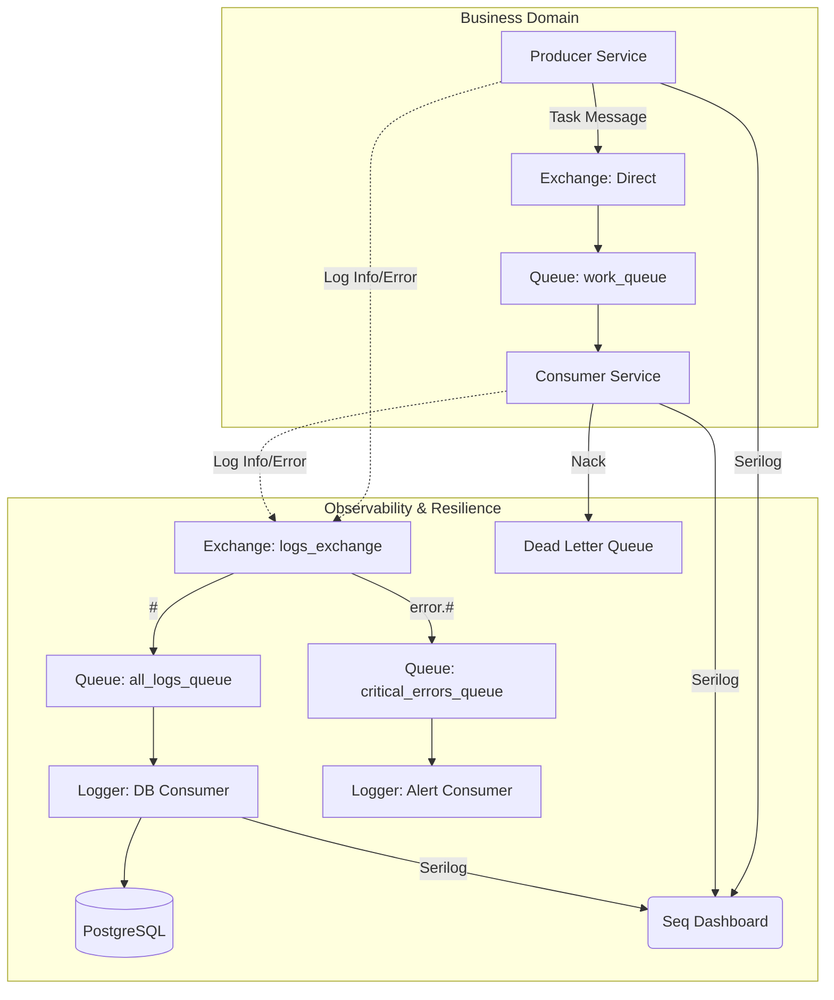

# 🛡️ Resilient Microservices with Centralized Logging


Демонстрация **Enterprise-архитектуры** микросервисов на .NET 8.
Проект реализует надежную обработку сообщений, централизованное логирование, мониторинг в реальном времени и автоматическое восстановление после сбоев.

---

## 🏗 Архитектура

Система построена на базе **Worker Services**, общается асинхронно через **RabbitMQ Topic Exchange** и использует **Seq** для агрегации логов.



---

## 🚀 Ключевые возможности (Senior Level)

### 🛡️ Reliability & Resilience (Надежность)
*   **Polly Policies:** Реализован паттерн **Retry with Exponential Backoff**. Сервисы не падают при старте, если инфраструктура недоступна, а "умно" ждут восстановления соединения.
*   **Dead Letter Queue (DLQ):** "Ядовитые" сообщения (Poison Messages), вызывающие сбои, не зацикливают систему, а автоматически изолируются в отдельную очередь для анализа.
*   **Worker Services:** Использование `IHostedService` для правильного управления жизненным циклом приложений.

### 🔍 Observability (Наблюдаемость)
*   **Structured Logging:** Использование **Serilog** для структурного логирования.
*   **Seq Dashboard:** Централизованный сбор логов. Удобный UI для поиска, фильтрации и анализа ошибок в реальном времени.

### ✅ Validation & Configuration
*   **Data Validation:** Использование **FluentValidation** для проверки входящих сообщений. Некорректные данные отбрасываются до записи в БД.
*   **Fail Fast:** Валидация конфигурации при старте (`ValidateOnStart`). Сервис не запустится, если забыли указать строку подключения.
*   **Options Pattern:** Строгая типизация настроек через `IOptions<T>`.

### 💾 Data Management
*   **EF Core Migrations:** Управление схемой базы данных через миграции, а не удаление базы.
*   **Topic Exchange:** Гибкая маршрутизация логов. Ошибки попадают в "Алертинг", а все логи — в "Архив".

---

## 🛠 Структура проекта

```text
📂 MicroservicesLogs
├── 📂 Common             # Shared Kernel: RabbitMqLogger, Models, Validators
├── 📂 Producer           # Генерирует задачи, отправляет логи, использует Polly
├── 📂 Consumer           # Обрабатывает задачи, использует DLQ, ручной Ack/Nack
├── 📂 LoggerService      # Слушает 2 очереди, пишет в Postgres, валидирует данные
└── 🐳 docker-compose.yml  # Оркестрация (RabbitMQ, Postgres, Seq, Apps)
```

---

## 🐳 Запуск (Docker)

**1. Чистый старт (с удалением старых данных):**
```bash
docker compose down -v
docker compose up -d --build
```

**2. Проверка состояния:**
```bash
docker ps
```
*Убедитесь, что все контейнеры имеют статус `healthy` или `Up`.*

---

## 📊 Мониторинг и Проверка

### 1. Логи и Графики (Seq) 🌟
Самый удобный способ следить за системой.
*   **URL:** [http://localhost:8081](http://localhost:8081)
*   **Login/Pass:** см. в `docker-compose.yml` (переменная `SEQ_FIRSTRUN_ADMINPASSWORD`).
*   *Здесь вы увидите логи всех трех сервисов в одном месте.*

### 2. Управление очередями (RabbitMQ)
*   **URL:** [http://localhost:15672](http://localhost:15672)
*   **Login/Pass:** `guest` / `guest` (или `admin`/`admin`, см. docker-compose).
*   *Проверьте вкладку Queues: вы увидите `work_queue`, `all_logs_queue`, `critical_errors_queue` и `dead_letter_queue`.*

### 3. Данные в БД (PostgreSQL)
Проверка сохраненных логов через терминал:
```bash
docker compose exec postgres psql -U postgres -d logs_db -c 'SELECT * FROM "Logs" ORDER BY "Timestamp" DESC LIMIT 10;'
```

---

## ⚙️ Конфигурация

Все настройки вынесены в `docker-compose.yml` и используют стандарт .NET (`Section__Property`).

| Переменная | Назначение |
| :--- | :--- |
| `LoggerSettings__ConnectionString` | Доступ к PostgreSQL |
| `LoggerSettings__RabbitMqHost` | Адрес брокера |
| `SEQ_API_KEY` | Токен для отправки логов в Seq |
| `SEQ_FIRSTRUN_ADMINPASSWORD` | Пароль администратора Seq (для первого входа) |

---
